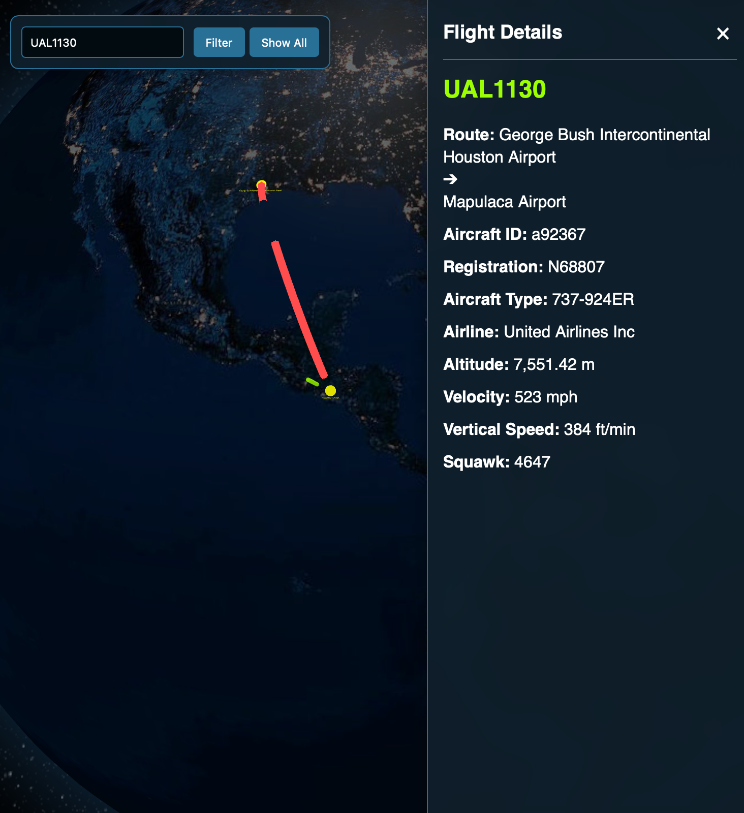

# Live 3D Flight Tracker Dashboard

A real-time, interactive 3D globe that visualizes live air traffic from around the world, built with Node.js, Express, and Globe.gl.



## About This Project

This project was built to provide a dashboard for aviation enthusiasts. It pulls live flight data from the OpenSky Network API, displays each flight on an interactive 3D globe, and allows users to click on individual flights to get detailed information about their route and the aircraft itself.

## Features

* **Real-time Global Visualization:** All flights are rendered on a 3D globe at their correct latitude, longitude, and scaled altitude.
* **Interactive Dashboard:** Click on any flight to open a side panel with detailed information, including:
    * Route (Origin & Destination)
    * Aircraft Type & Registration
    * Airline/Owner
    * Live Altitude, Velocity, and Vertical Speed
    * Transponder Squawk Code
* **Emergency Highlighting:** Flights broadcasting an emergency squawk code (7500, 7600, 7700) are automatically highlighted in red for immediate identification.
* **Flight Path Visualisation:** For selected flights with known routes, the full flight path is drawn as an arc across the globe, with markers for the departure and arrival airports.
* **Callsign Filtering:** Users can filter the flights shown on the globe by searching for a specific callsign.


## Tech Stack

* **Frontend:** HTML5, CSS3, Vanilla JavaScript, Globe.gl, three.js
* **Backend:** Node.js, Express.js
* **API:** [OpenSky Network REST API](https://opensky-network.org/apidoc/rest.html)

## Getting Started

To run this project locally, follow these steps:

### Prerequisites

You will need [Node.js](https://nodejs.org/) installed on your machine.

### Installation

1.  Clone the repository:
    ```bash
    git clone <https://github.com/josh098900/liveflight.git>
    ```
2.  Navigate to the project directory:
    ```bash
    cd <project-directory>
    ```
3.  Install the necessary backend dependencies:
    ```bash
    npm install
    ```
4.  Create a `.env` file in the root of the project and add your OpenSky Network credentials:
    ```
    OPENSKY_USER="your_opensky_client_id"
    OPENSKY_SECRET="your_opensky_client_secret"
    ```
5.  Start the server:
    ```bash
    node server.js
    ```
6.  Open your browser and navigate to `http://localhost:3000`.